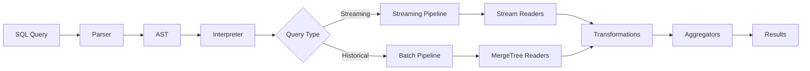

# Architecture

Timeplus Proton is a unified streaming and historical data processing engine built on top of ClickHouse. It extends ClickHouse's columnar storage and vectorized query execution with native stream processing capabilities, delivering a single binary solution for real-time analytics.

## Overview

Proton combines:
- **ClickHouse's proven OLAP engine** for historical data queries and storage
- **Native stream processing** for real-time data ingestion and continuous queries  
- **Distributed write-ahead log (WAL)** implemented using Kafka for replication and fault tolerance
- **Single C++ binary** with no JVM, no ZooKeeper dependencies


## Core Components

### Stream Storage Engine

Proton introduces a new storage engine called `StorageStream` that extends ClickHouse's `MergeTreeData`:

```cpp
// From src/Storages/Stream/StorageStream.h
class StorageStream : public MergeTreeData
{
    // Distributed data ingestion via Kafka WAL
    // Streaming query support
    // Simplified usability
};
```

**Key capabilities:**
- **Distributed ingestion**: Data is written to a distributed WAL (Kafka) and replicated across shards
- **Streaming queries**: Native support for continuous queries with `WHERE`, `GROUP BY`, and window functions
- **MergeTree integration**: Uses ClickHouse's MergeTree family for storage with automatic background merging

### Columnar Processing

Like ClickHouse, Proton uses vectorized query execution:

<Steps>

<Step title="Columnar storage">
Data is stored by columns (`IColumn` interface) with contiguous memory layout for cache efficiency
</Step>

<Step title="Vectorized execution">
Operations dispatch on arrays (vectors/chunks) rather than individual values for better CPU utilization
</Step>

<Step title="SIMD optimization">
Single Instruction Multiple Data operations accelerate aggregations and filters
</Step>

</Steps>

**From ClickHouse architecture:**
> "Operations are dispatched on arrays, rather than on individual values. This helps lower the cost of actual data processing through vectorized query execution."

### Block Streams

Data flows through the system as `Block`s - containers of column chunks:

```text
Block = [(IColumn, IDataType, column_name), ...]
```

**Processing pipeline:**
1. **IBlockInputStream** reads blocks from sources (streams, tables, Kafka)
2. **Transformations** filter, aggregate, join blocks immutably  
3. **IBlockOutputStream** writes results to destinations (views, external streams, storage)

<Note>
Proton uses a "pull" approach: when you pull a block from a stream, it recursively pulls from nested streams, creating an execution pipeline.
</Note>

## Query Processing Stages

<Tabs>
  <Tab title="Streaming Query">
    ```sql
    -- Continuous aggregation over a stream
    SELECT device, count(*), avg(temperature)
    FROM sensor_data
    GROUP BY device;
    ```

    **Execution flow:**
    1. Parser creates AST from SQL
    2. `InterpreterSelectQuery` builds streaming execution pipeline
    3. Stream shards read from WAL or external sources
    4. Streaming aggregator maintains state
    5. Results emit incrementally as data arrives
  </Tab>

  <Tab title="Historical Query">
    ```sql
    -- Query stored data in table mode
    SELECT device, count(*), avg(temperature)
    FROM table(sensor_data)
    GROUP BY device;
    ```

    **Execution flow:**
    1. Parser creates AST from SQL
    2. `InterpreterSelectQuery` builds batch execution pipeline  
    3. Read MergeTree parts from disk
    4. Apply aggregations on complete data set
    5. Return final results
  </Tab>
</Tabs>

## Stream Sharding

Proton distributes streams across multiple shards for parallelism:

```cpp
// Sharding configuration
UInt32 shards;  // Number of shards
ExpressionActionsPtr sharding_key_expr;  // Sharding expression
std::vector<StreamShardStorePtr> stream_shards;  // Shard stores
```

**Sharding strategies:**
- **Random**: Round-robin distribution across shards
- **Expression-based**: Hash on specified columns for co-location
- **Deterministic**: Same key always routes to same shard

<Info>
Sharding is transparent to queries - Proton automatically routes reads/writes to appropriate shards.
</Info>

## Storage Modes

Proton supports multiple storage backends:

| Mode | Description | Use Case |
|------|-------------|----------|
| `memory` | In-memory storage | High-speed streaming, temporary data |
| `default` | Disk-based MergeTree | Historical data, persistent streams |
| `append_only` | Append-only log | Event sourcing, audit logs |
| `changelog_kv` | CDC changelog | Database replication, change tracking |

## Query Execution Pipeline



## Write Path

<Steps>

<Step title="Ingest">
Client sends data via INSERT or external stream connector
</Step>

<Step title="Shard routing">
Sharding expression evaluates to determine target shard(s)
</Step>

<Step title="WAL append">
Data appends to distributed WAL (Kafka) with async callbacks
</Step>

<Step title="Background consumption">
Stream shards consume from WAL and write to MergeTree parts
</Step>

<Step title="Merge">
Background threads merge parts to optimize storage and queries
</Step>

</Steps>

<Warning>
Proton does not use MEMTABLE like LSM trees - data writes directly to filesystem as MergeTree parts. Use batch inserts (not single rows) for optimal performance.
</Warning>

## Read Path

### Streaming Mode

```cpp
// From StorageStream::read()
void read(
    QueryPlan & query_plan,
    const Names & column_names,
    SelectQueryInfo & query_info,
    ContextPtr context,
    size_t max_block_size,
    size_t num_streams
);
```

1. Determine shards to read based on query predicates
2. Create parallel stream readers for each shard
3. Apply filters and projections
4. Stream results continuously

### Historical Mode

Uses ClickHouse's standard MergeTree read path:
1. Consult primary index to identify candidate parts
2. Read marks files for column offsets  
3. Decompress and read column blocks
4. Apply filters and aggregations

## Performance Characteristics

**Benchmarks on Apple M2 Max:**
- **90 million events/sec** ingestion throughput
- **4ms end-to-end latency** for streaming queries
- **1 million unique keys** high-cardinality aggregation

**Optimizations:**
- Zero-copy reads from Kafka with direct block conversion
- SIMD-accelerated aggregations and filters
- Sparse primary indexes for range scans
- Column-level compression (LZ4, ZSTD)

## Fault Tolerance

Proton inherits ClickHouse's replication model with streaming enhancements:

<Accordion title="Replication mechanism">
- Each stream shard maps to a Kafka partition (or native log)
- Data replicates via Kafka replication factor
- On failure, consumers resume from last committed offset
- No distributed consensus required (no ZooKeeper)
</Accordion>

<Accordion title="Consistency model">
- **At-least-once** delivery by default
- **Exactly-once** with idempotent keys
- **Eventual consistency** for replicas
</Accordion>

## Integration with ClickHouse

Proton maintains full compatibility with ClickHouse:

```sql
-- Query ClickHouse external table from Proton
CREATE EXTERNAL TABLE ch_events
SETTINGS type='clickhouse',
         address='clickhouse.example.com:9000',
         database='analytics',
         table='events';

-- Join streaming data with historical ClickHouse data
SELECT s.user_id, s.event, c.user_name
FROM live_events s
JOIN ch_events c ON s.user_id = c.user_id;
```

## Next Steps

<CardGroup cols={2}>
  <Card title="Streams" icon="water" href="/concepts/streams">
    Learn about stream types and operations
  </Card>
  <Card title="External Streams" icon="plug" href="/concepts/external-streams">
    Connect to Kafka, Pulsar, and other sources
  </Card>
  <Card title="Materialized Views" icon="eye" href="/concepts/materialized-views">
    Build real-time data pipelines
  </Card>
  <Card title="Windows" icon="clock" href="/concepts/windows">
    Time-based aggregations and windowing
  </Card>
</CardGroup>